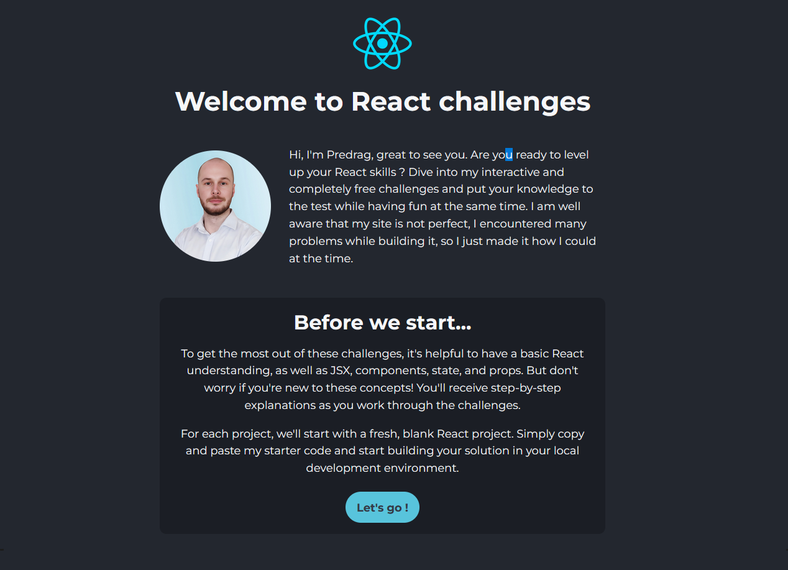

# React - Challenges

# 🔗 [Live Preview](https://react-challenges-predrag.netlify.app/)

---

## About 👋

Welcome, this project represents a group of easy (and one not so east) React challenges! Have fun solving the challenges and give this repo a star if you like this simple app that I created. The user is able to navigate between different pages and use buttons with event handlers.

---

## Challenges and Features 👨‍💻

- **01 Basic click event:** Make use of 'useState' and 'onClick' event to display a simple text when the button is clicked.
- **02 Toggle button:** Create a toggle button that will switch between two sentences.
- **03 Number counter:** Test a different angle of your 'useState' understanding that builds up on Toggle button challenge.
- **04 Map method:** Make use of 'map()' method and props to render the content dynamically in a new component.
- **05 Simple form:** This simple form challenge requires the basic understanding of controlled elements and.
- **06 To-do list** In this app, we will practice using: props, functions, useState, map method and integrating different components.
- **07 Data fetching** We need to fetch data with useEffect and display it using map method.
- **08 Complex form:** The final and hardest challenge. You need to code successful form submission with different types of values.

---

## Dependencies 📦

***dependencies:***
- @testing-library/jest-dom": ^5.17.0
- @testing-library/react": ^13.4.0
- @testing-library/user-event": ^13.5.0
- react: ^18.3.1
- react-dom: ^18.3.1
- react-icons: ^5.2.1
- react-router-dom: ^6.25.1
- react-scripts: 5.0.1
- react-syntax-highlighter: ^15.5.0
- web-vitals: ^2.1.4
  

***devDependencies:*** 
- @babel/plugin-proposal-private-property-in-object: ^7.21.11
- tailwindcss: ^3.4.7
  
---

## Languages

- React: routing, functions, conditionals, useState, components, useEffect.
- Styling: Tailwind

---

## Cloning and starting in local environment

1. On this Github project page, click the green buttons that says "code" 
2. Copy the HTTPS URL
3. Open the terminal by typing "cmd" command into your desktop start OR right click on desktop then click "Git Bash here" if you have git bash installed OR open visual studio code terminal by clicking "Terminal" -> "New Terminal"
4. Navigate to desktop inside the terminal using command "cd desktop"
5. run command inside the terminal "git clone {link}". Replace {link} with HTTPS URL from step 2
6. You now have cloned repo folder on your dektop.
7. Navigate inside it by typing into the terminal "cd [folder name]" Replace [folder name] with folder name.
8. Run command "npm i" to install all the dependencies.
9. Run command "npm start" to open live project on [localhost:3000/](http://localhost:3000/)

---

## Build/Deploy official boilerplate instructions.

This project was bootstrapped with [Create React App](https://github.com/facebook/create-react-app).

**Available Scripts**

In the project directory, you can run:

### `npm start`

Runs the app in the development mode.\
Open [http://localhost:3000](http://localhost:3000) to view it in your browser.

The page will reload when you make changes.\
You may also see any lint errors in the console.

### `npm test`

Launches the test runner in the interactive watch mode.\
See the section about [running tests](https://facebook.github.io/create-react-app/docs/running-tests) for more information.

### `npm run build`

Builds the app for production to the `build` folder.\
It correctly bundles React in production mode and optimizes the build for the best performance.

The build is minified and the filenames include the hashes.\
Your app is ready to be deployed!

See the section about [deployment](https://facebook.github.io/create-react-app/docs/deployment) for more information.

### `npm run eject`

**Note: this is a one-way operation. Once you `eject`, you can't go back!**

If you aren't satisfied with the build tool and configuration choices, you can `eject` at any time. This command will remove the single build dependency from your project.

Instead, it will copy all the configuration files and the transitive dependencies (webpack, Babel, ESLint, etc) right into your project so you have full control over them. All of the commands except `eject` will still work, but they will point to the copied scripts so you can tweak them. At this point you're on your own.

You don't have to ever use `eject`. The curated feature set is suitable for small and middle deployments, and you shouldn't feel obligated to use this feature. However we understand that this tool wouldn't be useful if you couldn't customize it when you are ready for it.

## Learn More

You can learn more in the [Create React App documentation](https://facebook.github.io/create-react-app/docs/getting-started).

To learn React, check out the [React documentation](https://reactjs.org/).

### Code Splitting

This section has moved here: [https://facebook.github.io/create-react-app/docs/code-splitting](https://facebook.github.io/create-react-app/docs/code-splitting)

### Analyzing the Bundle Size

This section has moved here: [https://facebook.github.io/create-react-app/docs/analyzing-the-bundle-size](https://facebook.github.io/create-react-app/docs/analyzing-the-bundle-size)

### Making a Progressive Web App

This section has moved here: [https://facebook.github.io/create-react-app/docs/making-a-progressive-web-app](https://facebook.github.io/create-react-app/docs/making-a-progressive-web-app)

### Advanced Configuration

This section has moved here: [https://facebook.github.io/create-react-app/docs/advanced-configuration](https://facebook.github.io/create-react-app/docs/advanced-configuration)

### Deployment

This section has moved here: [https://facebook.github.io/create-react-app/docs/deployment](https://facebook.github.io/create-react-app/docs/deployment)

### `npm run build` fails to minify

This section has moved here: [https://facebook.github.io/create-react-app/docs/troubleshooting#npm-run-build-fails-to-minify](https://facebook.github.io/create-react-app/docs/troubleshooting#npm-run-build-fails-to-minify)
